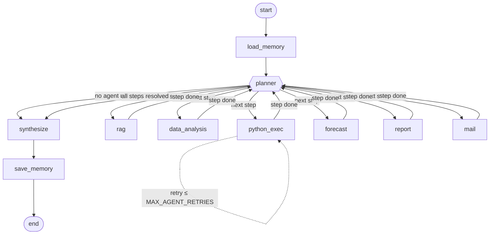

# Enterprise Multi-Agent Operations Copilot

A local-first, production-structured multi-agent system for enterprise operations workflows —
not a chatbot. A LangGraph **Planner** decomposes each request, routes it to only the specialist
agents actually needed, and composes their structured outputs into one cited answer.

Everything runs locally: **FastAPI + LangGraph + LangChain** on the backend, a local **Ollama**
model for inference, **ChromaDB** for vector search, **SQLite** for conversation/artifact memory,
and a **Next.js + Tailwind + ShadCN** chat UI on the frontend.

## Contents

- [Agents](#agents)
- [How a request flows through the system](#how-a-request-flows-through-the-system)
- [LangGraph state graph](#langgraph-state-graph)
- [Project layout](#project-layout)
- [Getting started](#getting-started)
- [Running it](#running-it)
- [Configuration reference](#configuration-reference)
- [Verifying it end-to-end](#verifying-it-end-to-end)
- [Known limitations](#known-limitations)

## Agents

| Agent | What it does |
|---|---|
| **Planner** | The LangGraph supervisor itself. Reads the request + conversation context, decides which agents are needed, builds an ordered step plan, and retries/degrades gracefully on failure. |
| **RAG** | Chunks and embeds uploaded PDFs into a per-conversation ChromaDB collection; answers questions with `(filename, page)` citations. |
| **Data Analysis** | Runs EDA over uploaded CSV/Excel (missing values, summary stats, correlations), renders a correlation heatmap, and writes business insights. |
| **Python Execution** | Generates Python (pandas/matplotlib/plotly) from the request, runs it in an isolated subprocess with a timeout + memory watchdog, and self-corrects on failure using the error message. |
| **Forecasting** | Projects a numeric metric forward using a linear trend over detected historical periods, with a confidence-band chart and narrative — distinct from Data Analysis (which describes the past) and Python Exec (arbitrary code). |
| **Report** | Assembles everything produced so far into a Markdown report, then exports PDF and PowerPoint versions. |
| **Mail** | Emails previously generated artifacts (reports, charts) to a recipient extracted from the request. |
| **Memory** | Persists conversation turns, uploaded files, and artifacts in SQLite; hydrates context for follow-up questions every turn. |

## How a request flows through the system

1. User uploads PDFs/CSV/XLSX and asks a question in a conversation.
2. **`load_memory`** hydrates context from SQLite: recent messages, uploaded files, prior artifacts.
3. **`planner`** decides which agents (if any) are needed and builds an ordered step plan.
4. Each step is routed to its agent, which returns to the planner when done. A failed step retries
   (up to `MAX_AGENT_RETRIES`) before the plan marks it failed and moves on — one bad step degrades
   the answer, it doesn't crash the run.
5. Once every step is resolved, **`synthesize`** streams the final answer, citing agent outputs.
6. **`save_memory`** persists the turn, any generated artifacts, and a per-agent trace to SQLite.

Each chat turn runs on its own LangGraph checkpointer thread — cross-turn memory is handled
explicitly via SQLite (`load_memory`/`save_memory`), not via LangGraph's checkpoint replay, so one
turn's plan/artifacts never leak into the next turn.

## LangGraph state graph



This is a simplified view of the real routing logic for readability — in the actual compiled
graph, *every* agent node can retry itself or fall through to the planner (see
`app/graph/router.py`), so the literal edge set is denser than drawn here. To see the exact
compiled graph:

```bash
cd backend
uv run python -c "
import asyncio
from app.core.config import get_settings
from app.graph.builder import build_graph

async def main():
    graph = await build_graph(get_settings())
    print(graph.get_graph().draw_mermaid())

asyncio.run(main())
"
```

## Project layout

```
backend/
  app/
    agents/       # one package per agent (planner, rag, data_analysis, python_exec,
                  #   forecast, report, mail, memory) - schemas + service logic + graph node
    graph/        # GraphState, the supervisor graph builder, routing
    api/          # FastAPI routes (conversations, files, chat SSE, artifacts) + DI
    db/           # SQLAlchemy models/CRUD (conversations, messages, files, artifacts, agent_runs)
    vectorstore/  # ChromaDB client, per-conversation collections
    llm/          # provider-agnostic chat/embedding factory (Ollama now, OpenAI/Gemini pluggable)
    core/         # settings (.env) + logging
  scripts/        # sample-data seeding, debug SMTP server, end-to-end smoke tests
frontend/
  app/conversations/[id]/   # chat workspace (upload, chat, plan/agent trace, artifacts)
  components/               # chat, upload, agent-trace, artifact-viewer components
  lib/                      # typed API client, hand-rolled SSE parser, chat hook
```

## Getting started

These are the one-time setup steps for a fresh clone. If you already have Ollama, `uv`, and
Node installed, skip to whichever step you need.

### 1. Install the prerequisites

| Tool | Why | Install |
|---|---|---|
| [Ollama](https://ollama.com) | Runs the local LLM + embedding model | Download from ollama.com |
| [uv](https://docs.astral.sh/uv/getting-started/installation/) | Manages the Python 3.11 backend environment | `winget install astral-sh.uv` (Windows) / `curl -LsSf https://astral.sh/uv/install.sh \| sh` (macOS/Linux) |
| [Node.js 18+](https://nodejs.org) | Runs the Next.js frontend | Download from nodejs.org |

### 2. Pull the models Ollama needs

With the Ollama app/service running:

```bash
ollama pull qwen2.5:7b-instruct
ollama pull nomic-embed-text
```

### 3. Clone and configure the backend

```bash
git clone https://github.com/jatin1bagga/enterprise-multi-agent-copilot.git
cd enterprise-multi-agent-copilot/backend
cp .env.example .env
uv sync
```

`uv sync` creates `backend/.venv` and installs every dependency pinned in `uv.lock`. The default
`.env` values work out of the box against a local Ollama install — you only need to edit it if you
want to enable the Mail Agent or switch LLM providers (see [Configuration reference](#configuration-reference)).

### 4. Configure the frontend

```bash
cd ../frontend
cp .env.example .env.local
npm install
```

The default `.env.local` (`NEXT_PUBLIC_API_BASE_URL=http://localhost:8000`) matches the backend's
default port, so no edits are needed for local use.

## Running it

Every time you want to run the app, start both processes (in two separate terminals):

**Terminal 1 — backend** (from `backend/`):
```bash
uv run uvicorn app.main:app --reload --port 8000
```
Check `http://localhost:8000/api/health` — it should report `"ollama": "reachable"`. If it says
`"unreachable"`, make sure the Ollama app/service is running.

**Terminal 2 — frontend** (from `frontend/`):
```bash
npm run dev
```

Then open **`http://localhost:3000`** — it creates a new conversation and redirects you straight
into the chat workspace. Upload a PDF/CSV/XLSX from the left sidebar, then ask a question.

## Configuration reference

Backend settings live in `backend/.env` (copied from `.env.example` in step 3 above):

- **LLM**: `LLM_PROVIDER` (`ollama` default; `openai`/`gemini` also supported), `OLLAMA_MODEL`,
  `OLLAMA_EMBED_MODEL`, `OLLAMA_BASE_URL`.
- **Storage paths**: `SQLITE_PATH`, `CHROMA_DIR`, `UPLOAD_DIR`, `ARTIFACT_DIR` (all under `data/`,
  created automatically on first run).
- **Sandbox**: `SANDBOX_TIMEOUT_SECONDS`, `SANDBOX_MEMORY_LIMIT_MB`, `MAX_AGENT_RETRIES`.
- **Mail Agent**: `SMTP_HOST`, `SMTP_PORT`, `SMTP_USERNAME`, `SMTP_PASSWORD`, `SMTP_FROM_ADDRESS`,
  `SMTP_USE_TLS`. Leave `SMTP_HOST` empty to disable emailing — the agent will say so instead of
  failing silently. For local testing without a real mail account, run
  `uv run python scripts/debug_smtp_server.py` (uses the `aiosmtpd` dev dependency already in
  `pyproject.toml`) and point `SMTP_HOST=localhost`, `SMTP_PORT=1025`, `SMTP_USE_TLS=false` at it;
  received mail is saved to `backend/scripts/received_mail/*.eml`.
- **Forecasting Agent**: `FORECAST_PERIODS_AHEAD` (how many future periods to project).

Frontend settings live in `frontend/.env.local`:

- `NEXT_PUBLIC_API_BASE_URL` — the backend's base URL.

## Verifying it end-to-end

With the backend running, these scripts drive the real HTTP/SSE API (no mocks):

```bash
cd backend
uv run python scripts/seed_sample_files.py         # writes scripts/sample_data/{sample.csv,sample.pdf}
uv run python scripts/smoke_test.py                # upload + RAG + data analysis
uv run python scripts/smoke_test_extra.py          # python execution + report generation
uv run python scripts/smoke_test_mail_forecast.py  # forecast -> report -> mail, multi-turn
uv run python scripts/smoke_test_memory.py         # cross-turn conversation memory
```

## Known limitations

- **The Python sandbox is process isolation, not a security boundary.** It runs generated code in
  a fresh subprocess with a timeout and an RSS memory watchdog so a bad script can't hang or crash
  the server — but it does not stop deliberately malicious code from touching the filesystem. This
  is an accepted tradeoff for a single-user local tool; see `app/agents/python_exec/sandbox.py`.
- **Forecasting uses a simple linear trend**, not a full time-series model — appropriate for small
  ad hoc business exports, called out explicitly in the agent's own narrative output.
- **ChromaDB collections are per-conversation**, so document retrieval is scoped to files uploaded
  in that conversation only.
